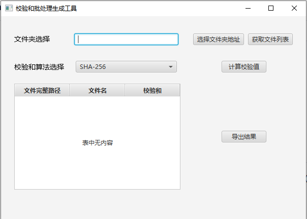
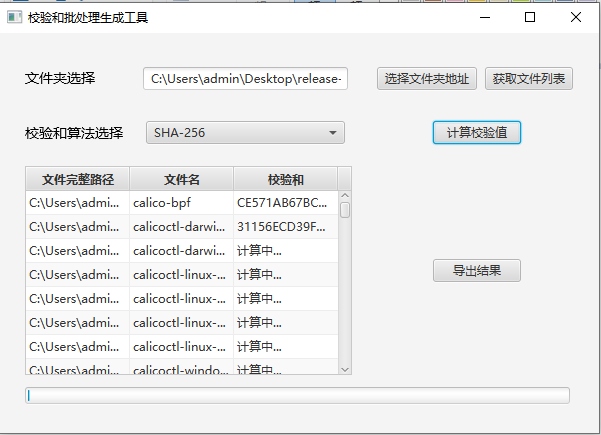
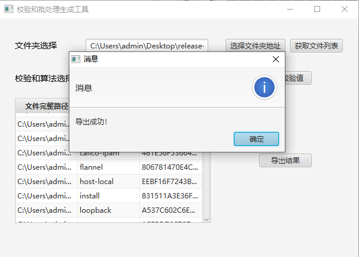

# 校验和批处理生成工具 (Checksum Batch Generator)

[](https://www.oracle.com/java/)
[](https://openjfx.io/)
[](LICENSE)

这是一款基于 JavaFX 开发的桌面工具，旨在提供简洁、高效的本地文件校验方案。它支持 SHA-256 和 MD5 算法的批量计算，并充分利用 JavaFX 的异步任务（Task）机制，确保在处理海量或超大文件时 UI 界面始终丝滑流畅

---

## ✨ 功能亮点

- **双算法切换**：支持用户在界面通过 ChoiceBox 或 ComboBox 实时选择 MD5 或 SHA-256 算法。

- **文件拖放支持**：支持将文件或文件夹直接拖入列表，极大提升操作便利性。

- **高性能流式计算**：通过缓冲区逐块读取文件，内存占用恒定，轻松应对数 GB 的超大文件。

- **异步批处理**：后台 Task 队列顺序处理任务，前端实时刷新数据行，避免界面假死。

- **可视化反馈**：集成 ProgressBar 进度条，实时展示当前批处理的完成情况。

---

## 🖥️ 截图





> 💡 *不同平台运行结果以实际结果为准*

---

## ⚙️ 运行环境要求

| 组件         | 版本                    | 说明                     |
| ------------ | ----------------------- | ------------------------ |
| **操作系统** | Windows / macOS / Linux | 全平台64位支持           |
| **Java**     | **JDK 8+ **             | 推荐使用JDK8，内置JavaFX |
| **内存**     | ≥ 512 MB                | 大文件处理建议 ≥ 2GB     |

> ⚠️ **重要**：  
> 普通 从OpenJDK 9+ 开始**不内置 JavaFX**！推荐使用 **JDK 8**，或单独安装 JavaFX SDK。

---

## 🚀 快速开始

推荐通过 `JRE`环境 和 下载 `SplitAndCombineFile.jar` 运行

### Windows / MacOS 平台

1. 下载 [最新 Release下的JAR包](https://github.com/Brian417-cup/AwesomeFileChecksum/releases/tag/v1.0.0) ，配置JRE8+环境
2. 终端执行：

  ```bash
java -jar <ChecksumBatchGenerator.jar完整路径>
  ```

> 💡 *如果有需要，在Windows平台可以通过 exe4j 等软件将jre和jar包打包成一个可执行文件来一键运行！！*

### Linux 平台

1. 下载 [最新 Release下的JAR包](https://github.com/Brian417-cup/AwesomeFileChecksum/releases/tag/v1.0.0) ，配置JRE8+环境
2. 配置 X Server 环境（针对终端服务器，否则跳过这步）

  ```bash
export DISPLAY=<客户端IP>:0.0
  ```

3. 终端执行：

  ```bash
java -Dprism.order=sw -jar <ChecksumBatchGenerator.jar完整路径>
  ```